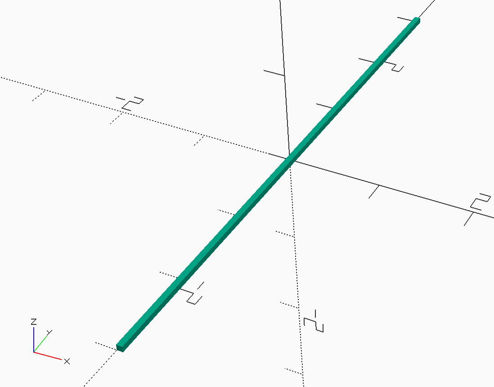
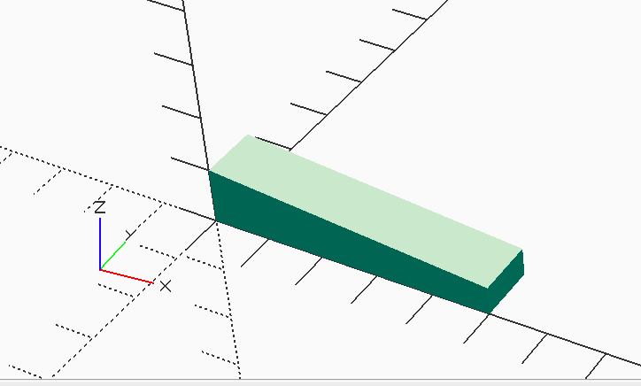
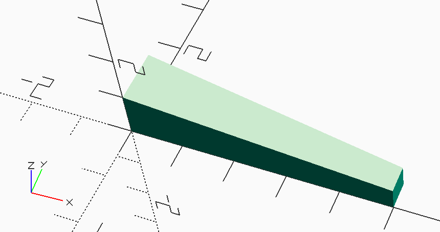
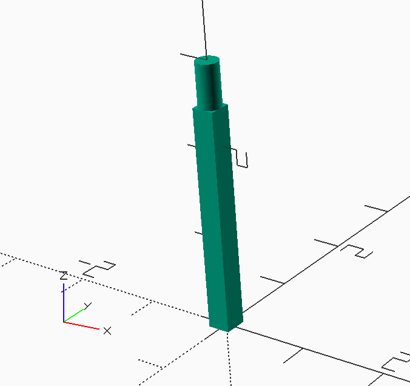
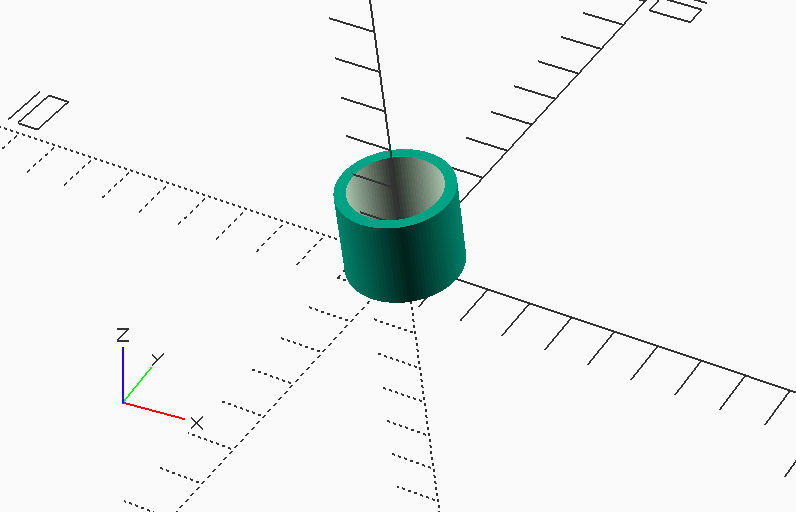

..  _library-parts:

Library Parts
#############

Several of the |OSC| code files developed are useful in other projects, so they
are collected into a library folder rather than just placing then in the
general model design folders. |OSC| supports loading files from user libraries
with a little setup. To do this, you must configure your system to add the
**OPENSCAD** environment variable so that the application can see this when you
start up |OSC|. Details can be found in the |OSC| documentation.

Colors
******

Here is a file listing available colors that can be used in generating the
visual representation of parts and assemblies. I added one color to represent
balsa wood. The original color file was created by *David Powell* and was found
in a post on the |OSC| forum at
https://forum.openscad.org/CSG-Difference-bogus-color-logic-td5265.html:

..  literalinclude::    ../../MMlib/colors.scad
    :linenos:
    :language: c

Positioning
***********

Since we need to position components many times during the building of the
final design, I created a simple routine that will translate and rotate
components for final placement in an assembly. This code uses a neat feature of
the |OSC| language that lets you apply a function to the code that follow this
one. The **align** function defined here significantly reduces the clutter of
the design code. The included **position** function applies translations only:

..  literalinclude::    ../../MMlib/position.scad
    :linenos:
    :language: c

Simple Spars
************

We use three basic spars in models: a straight square spar, a single tapered
spar, and a double tapered spar. Eventually, I will modify these routines to
allow for rectangular cross sections.

Square Spar
===========

..  literalinclude::    ../../MMlib/square_spar.scad
    :linenos:
    :language: c

Single Tapered Spar
===================

..  literalinclude::    ../../MMlib/single_taper_spar.scad
    :linenos:
    :language: c

Double taper Spar
=================

..  literalinclude::    ../../MMlib/double_taper_spar.scad
    :linenos:
    :language: c

Mounting Posts
**************

Indoor models are usually not glued together permanently. Instead, we use posts
and paper tubes to allow parts to be separated for transport.

Rounded Posts
=============

These are simple square pieces with a rounded top for the paper tube to slide
over.

..  literalinclude::    ../../MMlib/rounded_post.scad
    :linenos:
    :language: c

Paper Tubes
===========

Paper tubes, formed by glueing tissue strips wound over a mandrel of some
sort are attached to structural parts and placed to slide over mounting posts.

..  literalinclude::    ../../MMlib/paper_tube.scad
    :linenos:
    :language: c

