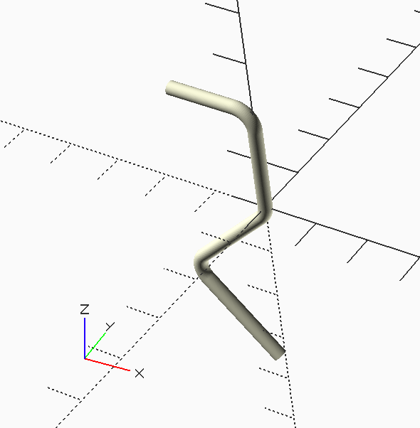

MMlpp Rear Hook
###############

The rear motor hook is a simple piece of bend wire. The motor stick provides
support for this piece, so some of the dimensions need to be derived from the
motor stick data.

The data file is a bit bigger than most, due to the need to define all the bends in the wire. Here is that file:

..  literalinclude::    ../../../../scad/fuselage/rear_hook/rear_hook_data.scad
    :linenos:

The code to generate this wire piece is also a bit involved:

..  literalinclude::    ../../../../scad/fuselage/rear_hook/rear_hook.scad
    :linenos:

Finally, here is the part:

