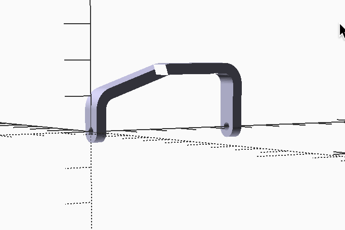

MMlpp Thrust Bearing
####################

In experimenting with |OSC| I started off trying to build a wire thrust
bearing. That effort was partially successful, bu tin the end, I decided to go
with as bent aluminum beaing. This took a bit of work, but it was not so bad.
Basically, is is a a simple piece of rectangular stock with rounded pieces on
the bearing ends.

Here is the data file needed:

..  literalinclude::    ../../../../scad/fuselage/thrust_bearing/thrust_bearing_data.scad
    :linenos:

The rectangular part of he bearing was created using a 2D shape that was then extruded to form the basic part, Two cylinderical sections wee added to cap off this part.

Here is the 2D file, created as a library file:

..  literalinclude::    ../../../../MMlib/prop_bearing_2D.scad
    :linenos:

And the code that generates the part:

..  literalinclude::    ../../../../scad/fuselage/thrust_bearing/thrust_bearing.scad
    :linenos:

Finally, here is the part.

..  todo::

    The thrust bearing  image has some rendering issues.
