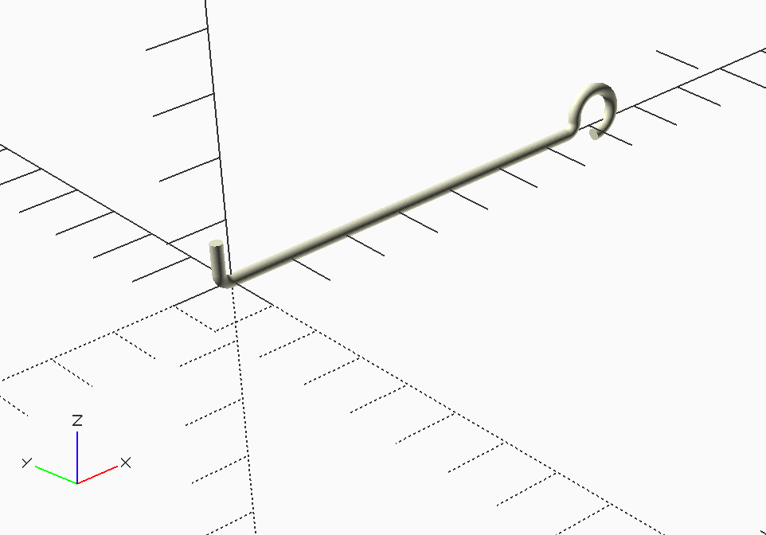

MMlpp Prop Wire Shaft
#####################

The wire shaft is a bit complex. Basically, the straight parts are just
cylinders. The curved parts are formed using a *rotate-extrude* function that
takes a circle and spins it around a circle of some radius. The code shows
this:

..  literalinclude::    ../../../../scad/prop/wire_shaft/wire_shaft.scad
    :linenos:

Here is an image of the final part:

