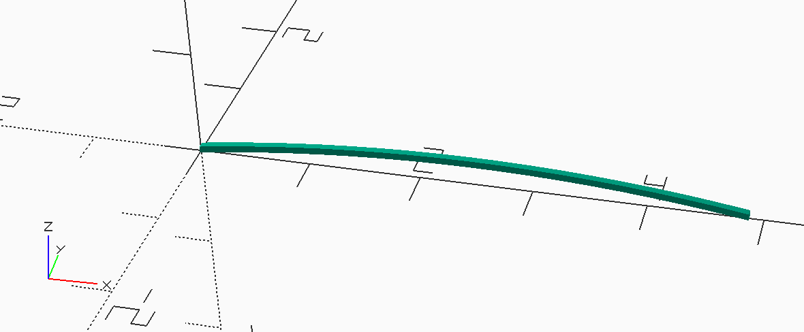

MMlpp Wing Center Ribs
######################

The center section is constructed using simple circular arc airfoil sections.
These ribs were formed by calculating the required radius, then constructing a
2D outline of the rib to ensure the leading and trailing edges match up with
the spars. This is consistent with ribs cut using a template.

The 2D form was set up using a library file:

..  literalinclude:: ../../../../../MMlib/circle_template_rib.scad
    :linenos:

Here is the code that generates a single rib:

..  literalinclude:: ../../../../../scad/wing/center/rib/rib.scad
    :linenos:
    :caption: wing/center/rib/rib.scad

And here is a sample rib:

