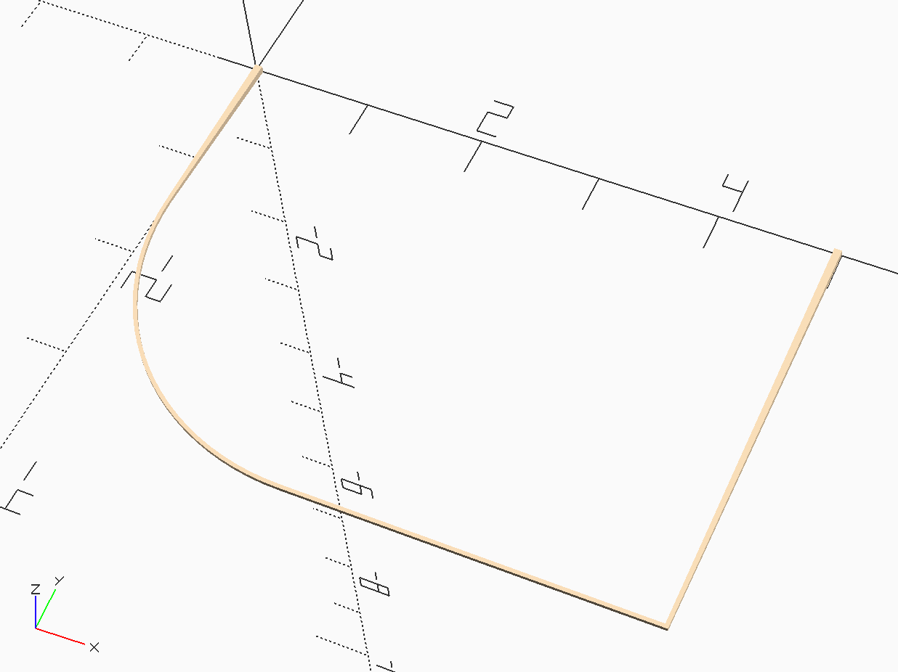

MMlpp Wing Left Tip
###################

The tips are a bit complex. I decided to use a double-tapered leading and
trailing edge to thin our the tips. The circular arc section and the tip rib
are all thinner square stock. The circular arc obviously needs to be formed
using a template. We will generate that in a later section of these notes.

Herr are the required parts needed for the tip:

..  toctree::
    :maxdepth: 2

    leading_edge/index
    trailing_edge/index
    tip_rib/index
    tip_arc/index

The positioning data is given in this file:

..  literalinclude::    ../../../../scad/wing/left_tip/left_tip_pos.scad
    :linenos:

Here is the code that assembles the tip section:

..  literalinclude::    ../../../../scad/wing/left_tip/left_tip.scad
    :linenos:

Here is the assembled left tip;

