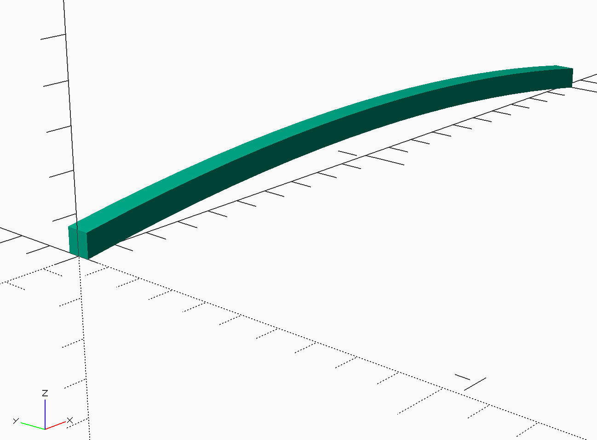
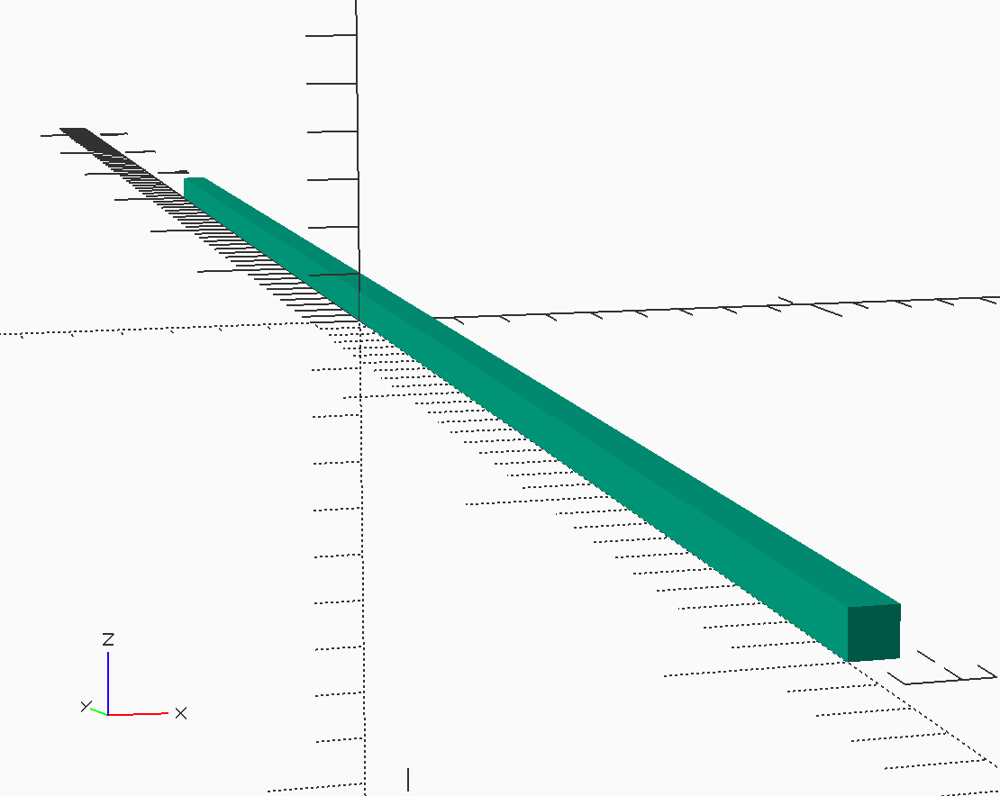

Wing Design
###########

I decided to make this wing fairly simple. Basically it uses a constant chord
with rounded tips. The wing uses a conventional flat center section, with the
tips raised to provide the needed stability. Here is the general layout:

..  tikz::
    :libs:  arrows, calc

    \draw[ultra thick]  (0,0) -- (8,0) -- (8,3);
    \draw[ultra thick]  (8,3) arc[
    start angle=0,
    end angle=90,
    x radius=2,
    y radius=2] -- (0,5);

    \draw[thin] (0,5) -- (0,5.5) node[above] {$ c_l $};
    \draw[thin] (0,0) -- (0,5);
    \draw[thin,->] (0,0) -- (0,-0.5) node [below] {$x$};

    \draw[thin] (4,5) -- (4,0) node[below] {$y_t$};

    \draw[thin] (6,5) -- (6,0) node[below] {$y_a$};
    \draw[thin] (6,3) -- (8,3);
    \draw[thin,->] (8,0) -- (8.5,0) node[right] {$y$};

    \draw[thin] (0,0) -- (-0.5,0);
    \draw[thin] (0,5) -- (-0.5,5);
    \draw[thin,<->] (-0.25,0) -- node[left] {$C$}(-0.25,5);

    \draw[thin,->] (6,3) --node[above left] {$r_t$}  +(45:2);

    \draw[thin] (8,3.5) -- (8,5.5);
    \draw[thin, <->] (0,5.25) -- node[above] {$S/2$}(8,5.25);

The center section is a simple rectangular structure with a constant chord. The
span of this section is a design decision. Setting this dimension will have an
effect on the span of the tips, since the total projected wing span is fixed by
the rule constraints. I decoded to set up the dimensions for the center section
in a data file that will be placed in a **wing** subdirectory under the main
design directory

..  literalinclude::    ../../scad/wing/wing_data.scad
    :language: c
    :caption:   math-magik-lpp/scad/wing/wing_data.scad
    :linenos:

Notice that we *include* the **constraints.data** file so we can refer to
constants defined there. The path to that file shows that it is in the
directory above the **wing** directory (the main design directory).

For reference, here are the named constants we are using and the symbols from
the figure above:

..  csv-table::
    :header: constant, figure

    center_span, :math:`2 * y_t`
    chord, :math:`c`
    tip_radius, :math:`r_t`

Wing Ribs
*********

I decided to use a simple circular arc airfoil for this design. The arc is
defined by specifying the *camber* as a percentage of the chord. Figuring out
the actual arc radius involves a bit of math, byyt a nice Python tool called
*SymPy* makes this pretty easy (see the appendix for details). The formula for
the arc is given below:

..  math::

    r = \frac{c^2}{8t} + \frac{t}{2}

Where :math:`c` is the airfoil chord, and :math:`t` is the thickness. This last
value is simply calculated form the chord and camber (:math:`T`):

..  math::

    t = \frac{Tc}{100}

There are two ways to build this rib. One way involves bending a strip of wood
over a form to produce the rib. The second way uses a template to cut the rib
out of sheet stock. In the first case, there is a problem you might not notice
in building a real airplane. Suppose you want to make the front and rear spars
out of simple square stock, and you want to mage the rib using the same size as
the spars. If you slice off the arc at the leading and trailing edges, the
height of the rib at both points is actually larger than the spar sizes. This
is easy to see using |OSC|, which led me to use the template approach.

If you use a template, the arc is used to make a first cut, then the template
is slid down by the spar size and a second cut produces a rib with exactly the
right height on both ends. The problem is finding a way to create this rib
using |OSC| code.

Template Rib Library Module
===========================

I ended up using the *linear extrude* feature of |OSC| to create a general rib
shape. This |OSC| *module* is our first *library module*. The parameters of
this module allow us to create ribs as needed for any design.

The outline of the rib is a 2D figure produced using the above formulas to
calculate the radius of the arc we need. The outline is formed by creating two
circles, shifted by the height of the rib. These circles are trimmed using 2D
square shapes.  Finally the outline is extruded to generate the 3D rib.

..  literalinclude::    ../../MMlib/circle_template_rib.scad
    :language: c
    :caption: MMlib/circle-template-rib.scad
    :linenos:

This is a bit scary on first look, but line by line it should make sense. The
|OSC| *module* is a reusable chunk of code we will need when generating our
actual ribs. The parameters we need to supply are these:

    * chord - the trimmed length of the rib (not including the spars)
    * camber - the thickness as a percentage of the chord
    * height - basically the height of the leading and trailing edge spars
    * thickness - the thickness of the sheet we will use to form the ribs

Notice that there is code after the *module8 definition that serves to display
the shape if we load this *library module* file in |OSC|. This code will not be
run when we generate actual ribs using this module. This technique is handy
when debugging code.

It is important to note the position of the rib in the coordinate system. The
origin of this system is sitting in the center of the leading edge, with the
bottom of thr rib sitting on the **X-Y** plane. The rib is oriented so the
**Z** is "up". The **Z** axis runs through the center of the rib. We will need
this information when we place ribs in the actual design.

Generating Wing Ribs
====================

Now, we can create a rib *module* for wing ribs. All we need to do here is set
the correct values for the parameters:

..  literalinclude::    ../../scad/wing/center/rib/rib.scad
    :language: c
    :caption:   math-magik-lpp/wing/center/rib/rib.scad
    :linenos:

We will use five of these ribs, each properly positioned to form the wing
center section.

Here is the basic rib shape, ready for placement in the wing:

Leading and Trailing Edges
**************************

The leading and trailing edge spars are something of a letdown! They are simple
square spars of a defined length. Again, it is handy to generate a *library
module* for a basic square spar.

..  literalinclude::    ../../MMlib/square_spar.scad
    :language: c
    :caption:   MMlib/square_spar.scad
    :linenos:

The spars created using this module are centered along the **Y** axis, again
sitting on the **X-Y** plane. This will be convenient for assembling the wing
center section.

Assembling the Center Section
*****************************

We have defined the parts needed to build the center section frame. All we need
to do is place the parts in the right positions. We will let |OSC| do the
calculations needed for this step.

We need to decide how to organize these parts before building this section. WHile it is possible to do this all in one file, doing the analytical work to predict the weight and balance data will be more difficult if we do that. Instead, I decided to create directories for each part, and set up placement data files that control where each part sits in the final model. Although this creates a lot of directories, it keeps things more organized as we generate additional files during the analysis phase.

For the wing center section, we will need eight new direcroties, five for the ribs, one each for leading and trailing edges, and a final one for the covering.

The ribs and spars are created using our library modulae. We will add a placement data file in each part directoriy that defines exactly where the part sits in the assembly we are creating.

..  note::

    This plaement is not where the part sits in the final model. We will move assemblies into place as we build the final model.

Let's look at the rib at the left side (pilot's view") of the center section.

..
..  literalinclude::    ../../scad/wing/center/center.scad
    :language: c
    :caption: wing/center/center.scad
    :linenos:

..  note::

    This code is set up to color the material. The **colors.scad** file
    containg a number of useful color definitions was found on the Internet,
    and I added a color for Balsa. The eliminates the ugly green color that is
    generated by default when |OSC| creates images.

